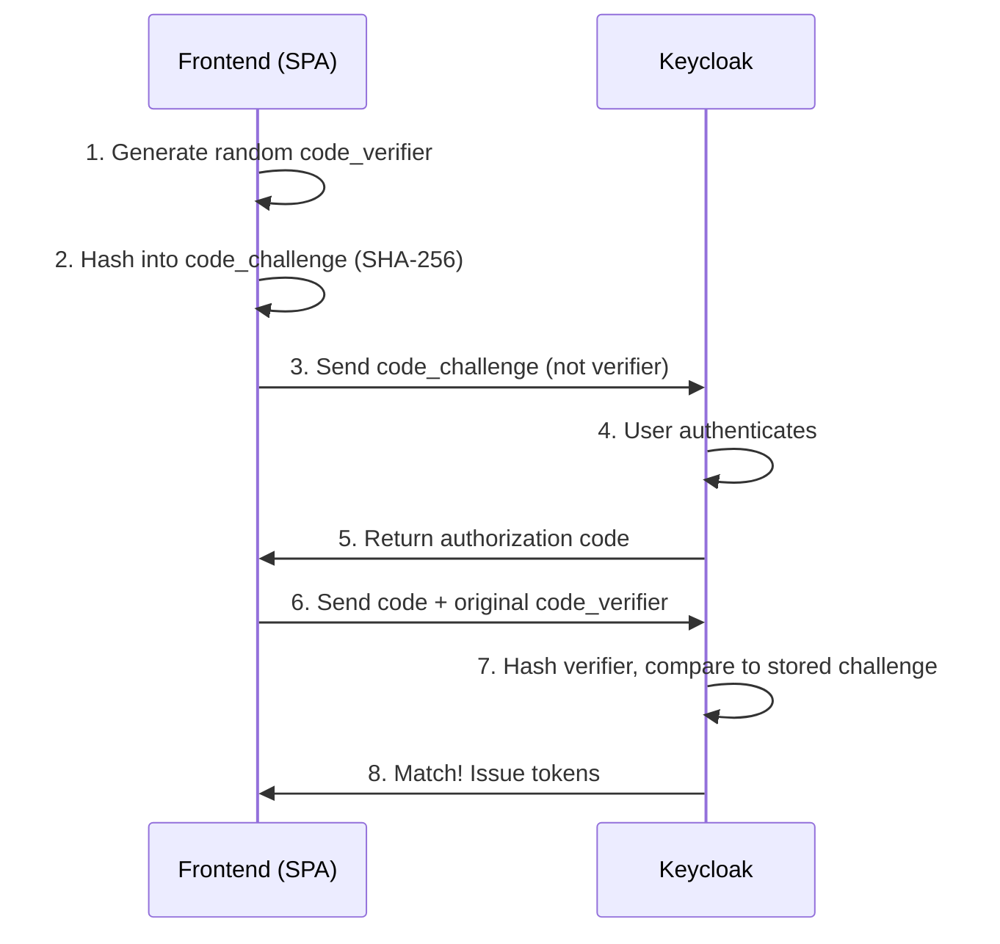
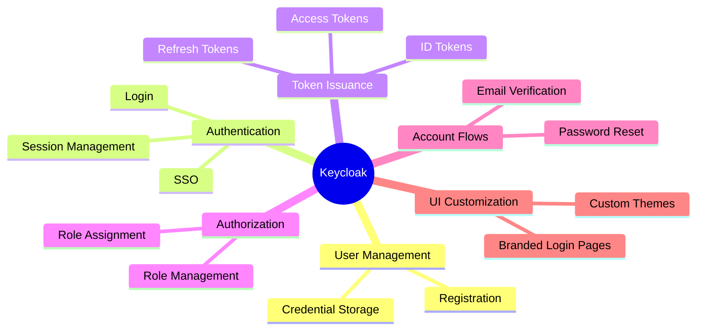
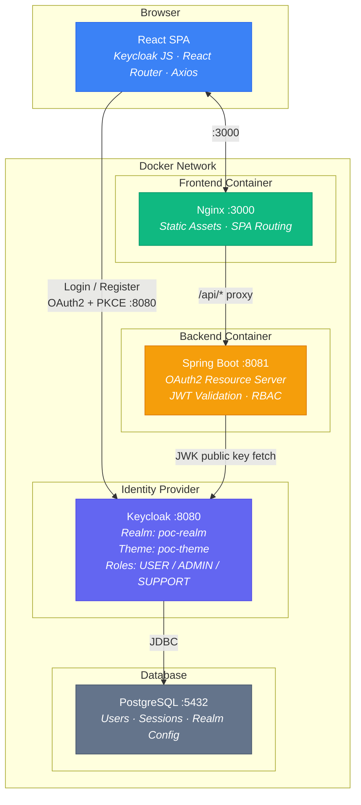
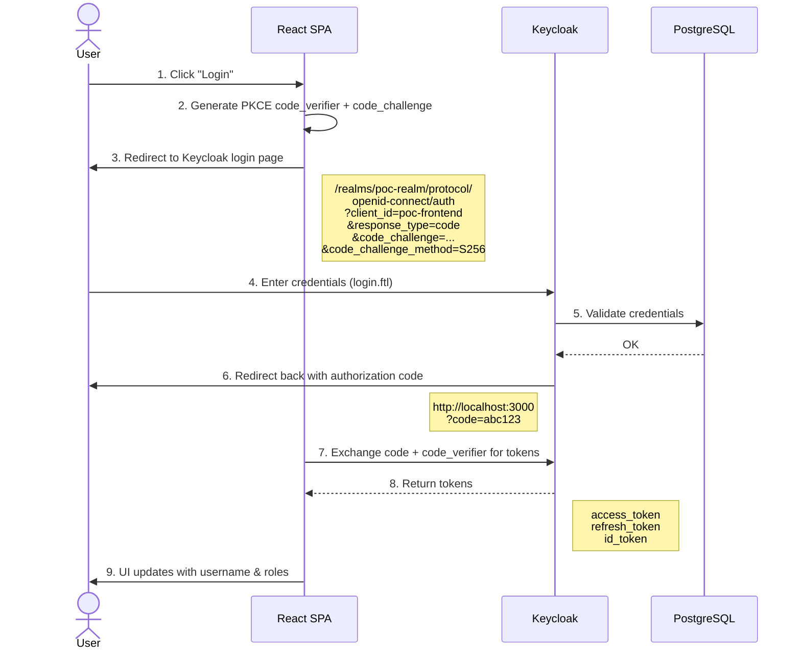
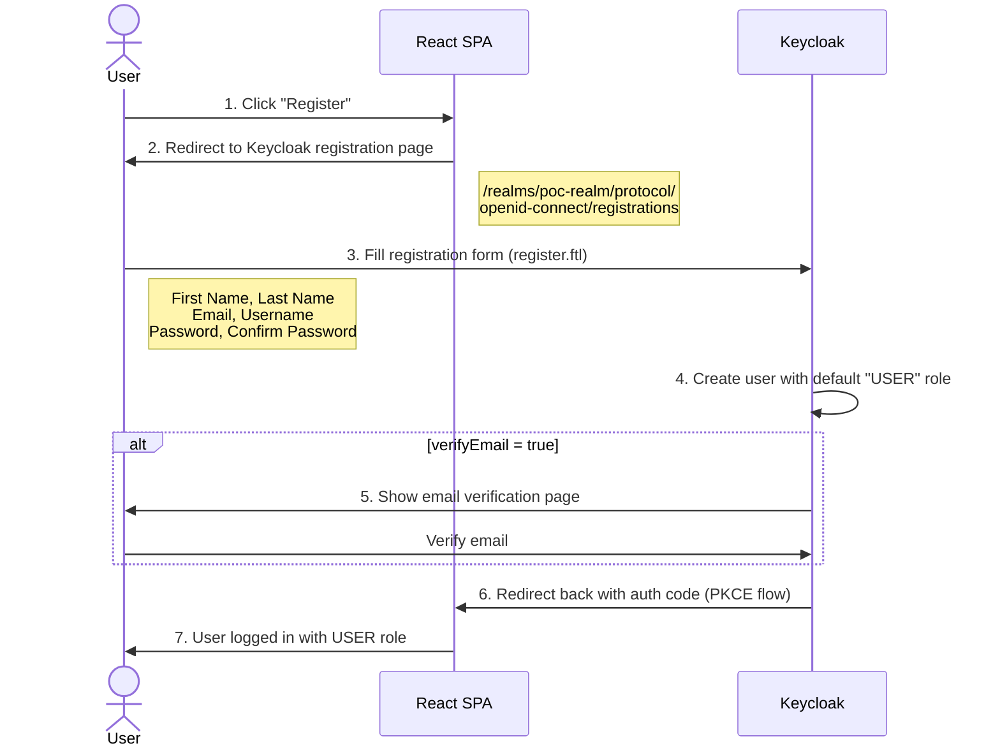
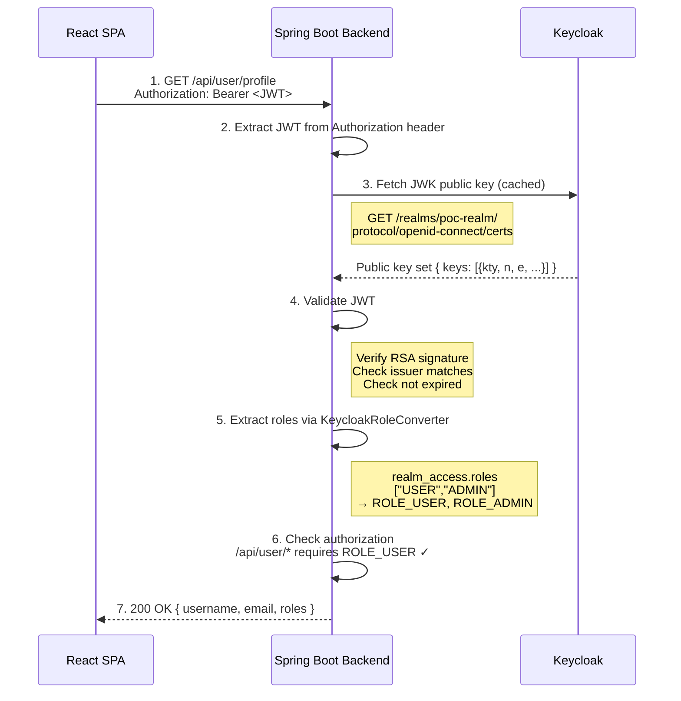
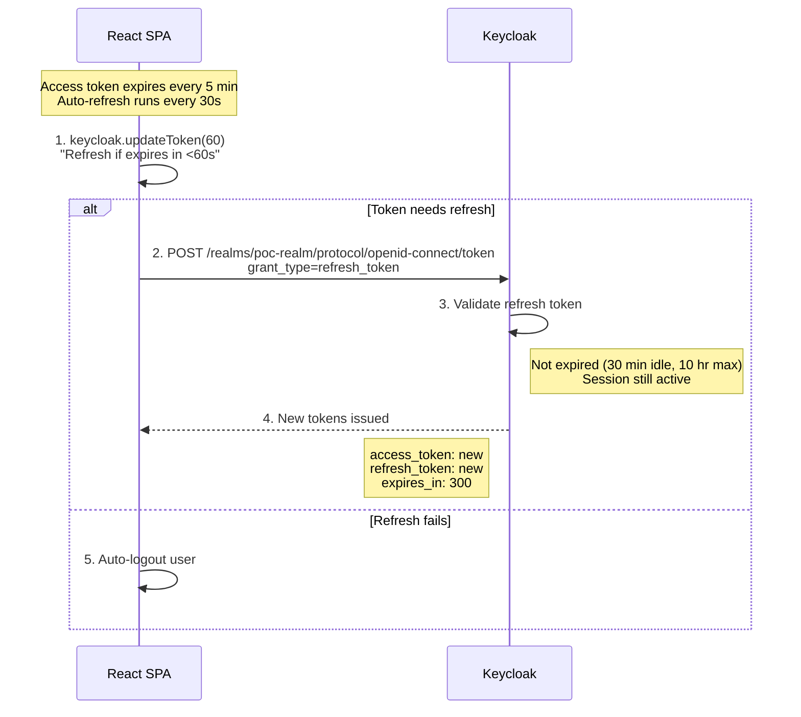
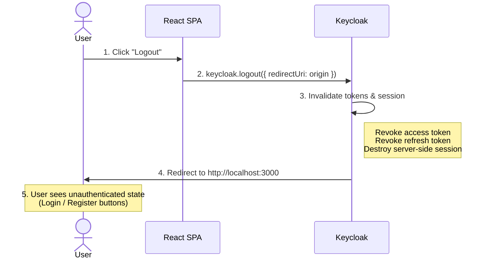
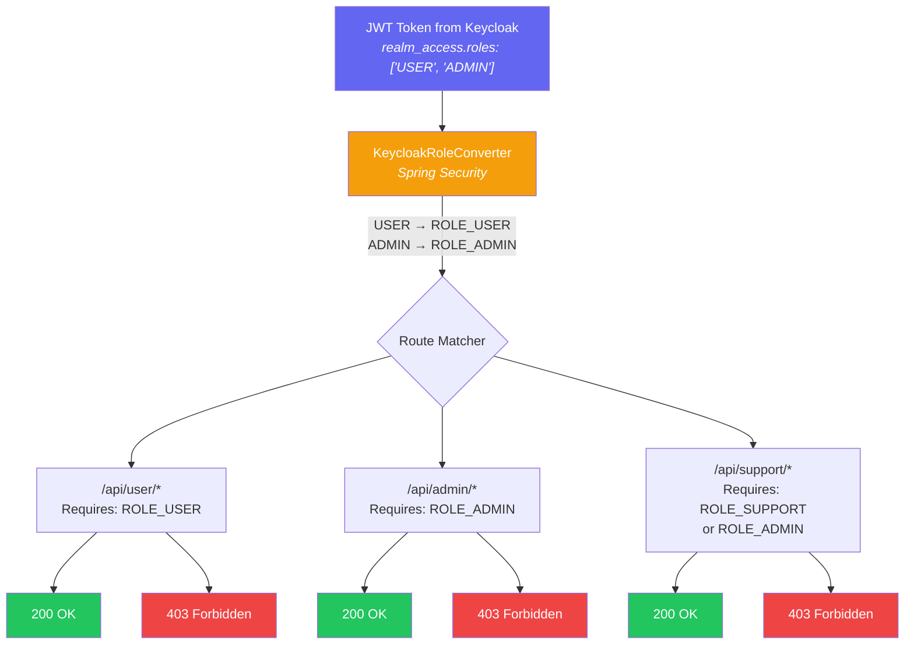
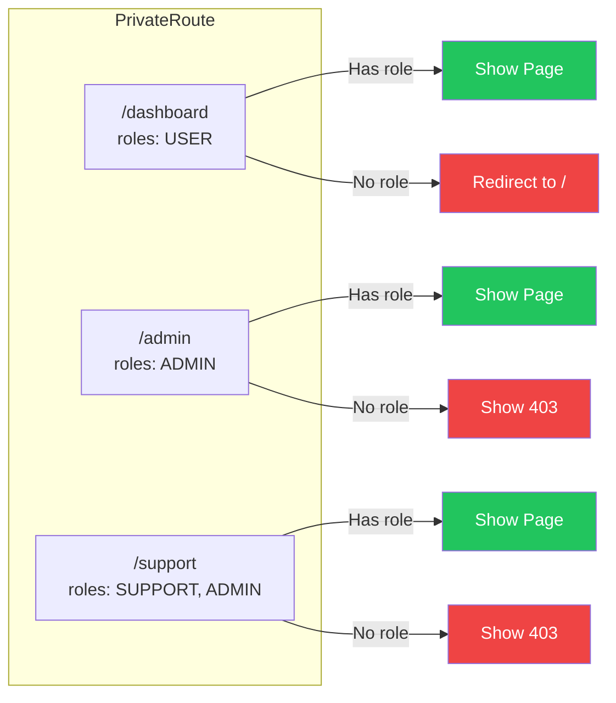

# Keycloak Authentication & Authorization POC

A production-ready Proof of Concept demonstrating **OAuth2/OIDC authentication and Role-Based Access Control (RBAC)** using Keycloak, Spring Boot, and React.

---

## Table of Contents

- [Core Concepts](#core-concepts)
  - [OAuth2 & OpenID Connect](#oauth2--openid-connect)
  - [Authorization Code Flow with PKCE](#authorization-code-flow-with-pkce)
  - [JWT (JSON Web Token)](#jwt-json-web-token)
  - [Role-Based Access Control (RBAC)](#role-based-access-control-rbac)
  - [Keycloak as Identity Provider](#keycloak-as-identity-provider)
- [Architecture](#architecture)
  - [High-Level Architecture Diagram](#high-level-architecture-diagram)
  - [Component Details](#component-details)
  - [Project Structure](#project-structure)
- [Flows](#flows)
  - [Login Flow](#1-login-flow)
  - [Registration Flow](#2-registration-flow)
  - [API Request Flow (JWT Validation)](#3-api-request-flow-jwt-validation)
  - [Token Refresh Flow](#4-token-refresh-flow)
  - [Logout Flow](#5-logout-flow)
  - [Role-Based Access Flow](#6-role-based-access-flow)
- [Tech Stack](#tech-stack)
- [Prerequisites](#prerequisites)
- [Setup & Installation](#setup--installation)
  - [1. Clone the Repository](#1-clone-the-repository)
  - [2. Run Initial Setup](#2-run-initial-setup)
  - [3. Configure Environment](#3-configure-environment)
  - [4a. Start with Docker (Recommended)](#4a-start-with-docker-recommended)
  - [4b. Start in Local Dev Mode](#4b-start-in-local-dev-mode)
  - [5. Stop Services](#5-stop-services)
- [Service URLs](#service-urls)
- [Test Accounts](#test-accounts)
- [API Endpoints](#api-endpoints)
- [Keycloak Configuration](#keycloak-configuration)
  - [Realm Settings](#realm-settings)
  - [Clients](#clients)
  - [Roles](#roles)
  - [Custom Theme](#custom-theme)
- [Frontend Routes](#frontend-routes)
- [Security Implementation Details](#security-implementation-details)

---

## Core Concepts

### OAuth2 & OpenID Connect

**OAuth2** is an authorization framework that allows third-party applications to access a user's resources without exposing their credentials. Instead of sharing passwords, OAuth2 uses **tokens** — short-lived, scoped credentials that prove a user authorized an action.

**OpenID Connect (OIDC)** is an identity layer built on top of OAuth2. While OAuth2 answers "what can this app do?", OIDC answers "who is this user?" by adding a standardized **ID Token** containing user identity claims (username, email, roles, etc.).

In this POC:
- The React frontend never sees or handles user passwords
- Keycloak manages all credential verification
- The backend API receives a JWT token and validates it without calling Keycloak on every request

### Authorization Code Flow with PKCE

The **Authorization Code Flow** is the most secure OAuth2 flow for web applications. **PKCE** (Proof Key for Code Exchange, pronounced "pixy") adds an extra security layer specifically designed for public clients like SPAs that cannot securely store a client secret.

How PKCE works:



This prevents authorization code interception attacks — even if an attacker steals the authorization code, they cannot exchange it for tokens without the original `code_verifier`.

### JWT (JSON Web Token)

A **JWT** is a compact, self-contained token that carries user claims as a signed JSON payload. It has three parts separated by dots:

```
Header.Payload.Signature
```

Example decoded payload from this POC:

```json
{
  "iss": "http://localhost:8080/realms/poc-realm",
  "sub": "a1b2c3d4-...",
  "preferred_username": "testadmin",
  "email": "testadmin@example.com",
  "realm_access": {
    "roles": ["USER", "ADMIN"]
  },
  "exp": 1708386123
}
```

The backend validates JWTs by:
1. **Signature verification** — using Keycloak's public key (fetched from JWK endpoint)
2. **Issuer validation** — confirming the token came from the expected Keycloak realm
3. **Expiration check** — rejecting expired tokens

Because JWTs are self-contained and signed, the backend can validate them without calling Keycloak on every request — making the system **stateless** and **horizontally scalable**.

### Role-Based Access Control (RBAC)

RBAC restricts system access based on assigned **roles**. Each role represents a set of permissions:

| Role | Backend Access | Frontend Pages |
|------|---------------|----------------|
| USER | `/api/user/*` | Dashboard |
| ADMIN | `/api/admin/*` + `/api/support/*` | Dashboard, Admin, Support |
| SUPPORT | `/api/support/*` | Dashboard, Support |

Authorization is enforced at **two layers**:
- **Backend (authoritative)** — Spring Security checks JWT roles before processing requests. This is the real security boundary.
- **Frontend (UX only)** — React hides menu items and routes the user cannot access. This is purely for user experience and is never trusted for security.

### Keycloak as Identity Provider

**Keycloak** is an open-source Identity and Access Management (IAM) solution. In this architecture, it serves as the **single source of truth** for all identity operations:



Neither the frontend nor backend store passwords or manage sessions — Keycloak handles all of it.

---

## Architecture

### High-Level Architecture Diagram



### Component Details

| Component | Technology | Port | Role |
|-----------|-----------|------|------|
| **Frontend** | React 18 + TypeScript, served by Nginx | 3000 | SPA with Keycloak JS adapter for authentication |
| **Backend** | Spring Boot 3.2.5, Java 17 | 8081 | Stateless REST API, validates JWTs, enforces RBAC |
| **Keycloak** | Keycloak 26.0 | 8080 | Identity Provider — issues tokens, manages users/roles |
| **PostgreSQL** | PostgreSQL 16 Alpine | 5432 | Persistent storage for Keycloak (users, sessions, config) |

### Project Structure

```
keycloak-poc/
├── docker-compose.yml              # Multi-service orchestration
├── .env.example                    # Environment variable template
├── setup.sh                        # Initial project setup
├── start-docker.sh                 # Launch all services in Docker
├── start-local.sh                  # Launch Keycloak in Docker + local dev servers
├── stop.sh                         # Shut down all services
│
├── backend/                        # Spring Boot REST API
│   ├── pom.xml                     # Maven config (Java 17, Spring Boot 3.2.5)
│   ├── Dockerfile                  # Multi-stage build
│   └── src/main/
│       ├── java/com/poc/keycloak/
│       │   ├── KeycloakPocApplication.java
│       │   ├── config/
│       │   │   ├── SecurityConfig.java        # Route authorization rules
│       │   │   ├── CorsConfig.java            # CORS policy
│       │   │   └── JwtConfig.java             # JWT decoder + multi-issuer validation
│       │   ├── security/
│       │   │   └── KeycloakRoleConverter.java # JWT realm_access → Spring roles
│       │   └── controller/
│       │       ├── PublicController.java       # /api/public/* (no auth)
│       │       ├── UserController.java         # /api/user/* (USER role)
│       │       ├── AdminController.java        # /api/admin/* (ADMIN role)
│       │       └── SupportController.java      # /api/support/* (SUPPORT|ADMIN)
│       └── resources/
│           └── application.yml                # Spring + OAuth2 config
│
├── frontend/                       # React SPA
│   ├── package.json                # Dependencies (React 18, Keycloak JS 26.0)
│   ├── Dockerfile                  # Multi-stage build (Node → Nginx)
│   ├── nginx.conf                  # SPA routing + /api/* proxy to backend
│   ├── public/
│   │   └── silent-check-sso.html   # OIDC silent session check
│   └── src/
│       ├── App.tsx                  # Routes + PrivateRoute wrappers
│       ├── App.css                  # Global styles
│       ├── auth/
│       │   ├── keycloak.ts          # Keycloak JS client initialization
│       │   ├── AuthProvider.tsx     # Auth context + token lifecycle
│       │   ├── useAuth.ts           # Auth hook for components
│       │   └── PrivateRoute.tsx     # Route guard with role checks
│       ├── api/
│       │   └── client.ts            # Axios instance + JWT interceptor
│       ├── components/
│       │   ├── Navbar.tsx           # Header bar (shared CSS with Keycloak)
│       │   └── Unauthorized.tsx     # 403 page
│       ├── pages/
│       │   ├── HomePage.tsx         # Public landing page
│       │   ├── DashboardPage.tsx    # User dashboard (USER role)
│       │   ├── AdminPage.tsx        # Admin panel (ADMIN role)
│       │   └── SupportPage.tsx      # Support tickets (SUPPORT role)
│       └── shared/
│           └── header.css           # Shared navbar styles (copy from shared/)
│
├── keycloak/                        # Keycloak configuration
│   ├── realm-export.json            # Realm definition (roles, clients, users)
│   └── themes/poc-theme/login/      # Custom login theme
│       ├── login.ftl                # Login page
│       ├── register.ftl             # Registration page
│       ├── login-reset-password.ftl # Password reset page
│       ├── login-verify-email.ftl   # Email verification page
│       ├── error.ftl                # Error page
│       ├── theme.properties         # Theme config (parent: base)
│       └── resources/css/
│           ├── header.css           # Shared navbar styles (copy from shared/)
│           └── login.css            # Login form styles
│
└── shared/css/
    └── header.css                   # Single source of truth for header styles
```

---

## Flows

### 1. Login Flow



### 2. Registration Flow



### 3. API Request Flow (JWT Validation)



### 4. Token Refresh Flow



### 5. Logout Flow



### 6. Role-Based Access Flow

#### Backend Authorization (Security Boundary)



#### Frontend Route Guards (UX Only — Not a Security Boundary)



---

## Tech Stack

| Layer | Technology | Version |
|-------|-----------|---------|
| Identity Provider | Keycloak | 26.0 |
| Backend Framework | Spring Boot | 3.2.5 |
| Backend Language | Java | 17 |
| Backend Security | Spring Security + OAuth2 Resource Server | 6.x |
| Frontend Framework | React | 18.3 |
| Frontend Language | TypeScript | 4.9 |
| Auth Adapter | keycloak-js | 26.0 |
| HTTP Client | Axios | 1.7 |
| Frontend Router | react-router-dom | 6.23 |
| Database | PostgreSQL | 16 |
| Web Server | Nginx | Alpine |
| Containerization | Docker + Docker Compose | Latest |

---

## Prerequisites

- **Docker** and **Docker Compose** (v2)
- **Git**
- For local dev mode only:
  - **Java 17+** (JDK)
  - **Node.js 18+** and **npm**
  - **Maven** (or use the included Maven wrapper)

---

## Setup & Installation

### 1. Clone the Repository

```bash
git clone <repository-url>
cd keycloak-poc
```

### 2. Run Initial Setup

```bash
chmod +x setup.sh start-docker.sh start-local.sh stop.sh
./setup.sh
```

This will:
- Create `.env` from `.env.example` (if not already present)
- Install frontend npm dependencies

### 3. Configure Environment

Edit `.env` to customize passwords and settings:

```env
# PostgreSQL
POSTGRES_DB=keycloak
POSTGRES_USER=keycloak
POSTGRES_PASSWORD=changeme_db_password        # Change for production

# Keycloak Admin Console
KEYCLOAK_ADMIN=admin
KEYCLOAK_ADMIN_PASSWORD=changeme_admin_password  # Change for production

# Backend — JWT validation endpoints
SPRING_SECURITY_OAUTH2_RESOURCESERVER_JWT_ISSUER_URI=http://localhost:8080/realms/poc-realm
SPRING_SECURITY_OAUTH2_RESOURCESERVER_JWT_JWK_SET_URI=http://localhost:8080/realms/poc-realm/protocol/openid-connect/certs

# Frontend — Keycloak connection
REACT_APP_KEYCLOAK_URL=http://localhost:8080
REACT_APP_KEYCLOAK_REALM=poc-realm
REACT_APP_KEYCLOAK_CLIENT_ID=poc-frontend
REACT_APP_API_URL=http://localhost:8081
```

### 4a. Start with Docker (Recommended)

This starts all four services (PostgreSQL, Keycloak, Backend, Frontend) in Docker containers:

```bash
./start-docker.sh
```

The script will:
1. Build all Docker images
2. Start services in dependency order
3. Wait for Keycloak to be healthy (up to 120 seconds)
4. Wait for the Backend to be healthy (up to 60 seconds)
5. Verify the Frontend is responding
6. Print service URLs and test credentials

**First startup may take 3-5 minutes** as Docker downloads images and Maven/npm install dependencies.

### 4b. Start in Local Dev Mode

This runs Keycloak + PostgreSQL in Docker, but starts the backend and frontend locally for **hot-reload** during development:

```bash
./start-local.sh
```

This will:
1. Start PostgreSQL and Keycloak in Docker
2. Start Spring Boot backend locally (`mvn spring-boot:run`)
3. Start React frontend locally (`npm start`)
4. Enable hot-reload for both frontend and backend changes

Press `Ctrl+C` to stop the local backend and frontend. Keycloak continues running — use `./stop.sh` to shut it down.

### 5. Stop Services

```bash
./stop.sh                        # Stop containers (preserves data)
docker compose down -v           # Stop containers AND delete all data
```

---

## Service URLs

| Service | URL | Description |
|---------|-----|-------------|
| **Frontend** | http://localhost:3000 | React SPA — main application |
| **Backend API** | http://localhost:8081 | Spring Boot REST API |
| **Keycloak** | http://localhost:8080 | Identity Provider |
| **Keycloak Admin Console** | http://localhost:8080/admin | Realm management UI |
| **Health Check** | http://localhost:8081/api/public/health | Backend health endpoint |

---

## Test Accounts

Three pre-configured users are available for testing different role scenarios:

| Username | Password | Roles | Access |
|----------|----------|-------|--------|
| `testuser` | `testuser123` | USER | Dashboard |
| `testadmin` | `testadmin123` | USER, ADMIN | Dashboard, Admin, Support |
| `testsupport` | `testsupport123` | USER, SUPPORT | Dashboard, Support |

**Keycloak Admin Console** credentials (for managing realm):
- Username: `admin` (or as set in `.env`)
- Password: `changeme_admin_password` (or as set in `.env`)

---

## API Endpoints

### Public (No Authentication)

| Method | Endpoint | Description |
|--------|----------|-------------|
| GET | `/api/public/health` | Service health check |

### User (Requires USER role)

| Method | Endpoint | Description |
|--------|----------|-------------|
| GET | `/api/user/profile` | Current user profile (username, email, roles) |
| GET | `/api/user/dashboard` | Dashboard data (notifications, stats) |

### Admin (Requires ADMIN role)

| Method | Endpoint | Description |
|--------|----------|-------------|
| GET | `/api/admin/users` | List all users |
| GET | `/api/admin/settings` | System settings |

### Support (Requires SUPPORT or ADMIN role)

| Method | Endpoint | Description |
|--------|----------|-------------|
| GET | `/api/support/tickets` | List support tickets |

---

## Keycloak Configuration

### Realm Settings

| Setting | Value | Purpose |
|---------|-------|---------|
| Realm Name | `poc-realm` | Realm identifier |
| Display Name | `Keycloak POC` | Shown in UI |
| Registration | Enabled | Users can self-register |
| Email Verification | Enabled | Users must verify email |
| Password Reset | Enabled | Forgot password flow |
| Login with Email | Enabled | Email as username alternative |
| SSL Required | External | HTTPS enforced for non-localhost |
| Access Token Lifespan | 5 minutes | Short-lived for security |
| SSO Session Idle | 30 minutes | Session timeout |
| SSO Session Max | 10 hours | Maximum session duration |
| Default Role | USER | Assigned to all new users |

### Clients

**poc-frontend** (Public SPA Client)
- Client type: Public (no client secret)
- Flow: Authorization Code + PKCE (S256)
- Root URL: `http://localhost:3000`
- Valid redirect URIs: `http://localhost:3000/*`
- Web origins: `http://localhost:3000`

**poc-backend** (Resource Server)
- Client type: Bearer-only
- No direct user interaction — validates JWTs only

### Roles

| Role | Type | Default | Description |
|------|------|---------|-------------|
| USER | Realm | Yes | Standard user access |
| ADMIN | Realm | No | Full administrative access |
| SUPPORT | Realm | No | Support team access |

### Custom Theme

The Keycloak login pages use a custom theme (`poc-theme`) that visually matches the React frontend:

- Shared header CSS between frontend Navbar and Keycloak pages
- Consistent gradient header bar, Inter font, indigo color scheme
- Custom pages: login, registration, password reset, email verification, error
- Login page shows a "Register" button in the header
- Registration page shows a "Login" button in the header

---

## Frontend Routes

| Route | Page | Access | Description |
|-------|------|--------|-------------|
| `/` | HomePage | Public | Landing page with feature overview |
| `/dashboard` | DashboardPage | USER role | User profile and dashboard stats |
| `/admin` | AdminPage | ADMIN role | User management and system settings |
| `/support` | SupportPage | SUPPORT or ADMIN | Support ticket management |

---

## Security Implementation Details

### Token Storage
- Access tokens are stored **in memory only** (never in localStorage or sessionStorage)
- The Keycloak JS adapter manages token lifecycle internally
- Tokens are automatically cleared on page refresh or logout

### JWT Validation (Backend)
- Uses Keycloak's **JWK (JSON Web Key) endpoint** to fetch public keys
- Validates token **signature**, **issuer**, and **expiration**
- Supports multiple issuers to handle Docker internal and external URLs
- Implemented in `JwtConfig.java` with Spring's `NimbusJwtDecoder`

### Role Extraction
- `KeycloakRoleConverter.java` extracts roles from the JWT `realm_access.roles` claim
- Maps Keycloak roles to Spring Security `GrantedAuthority` objects (prefixed with `ROLE_`)
- Spring Security's `@PreAuthorize` or `requestMatchers` then enforce access

### CORS Policy
- Configured in `CorsConfig.java`
- Only allows requests from the frontend origin (`http://localhost:3000`)
- Allows `Authorization` and `Content-Type` headers
- Credentials (cookies/auth headers) are allowed

### Session Management
- Backend is **fully stateless** — no server-side sessions
- Spring Security session policy: `STATELESS`
- CSRF protection is disabled (safe because authentication is JWT-based, not cookie-based)

### PKCE Configuration
- Challenge method: **S256** (SHA-256)
- Configured on both the Keycloak client and the frontend Keycloak JS adapter
- Prevents authorization code interception attacks

### Silent SSO Check
- On page load, the frontend checks for an existing Keycloak session using a hidden iframe (`silent-check-sso.html`)
- If a valid session exists, the user is automatically logged in without a redirect
- If no session exists, the user sees the unauthenticated state
